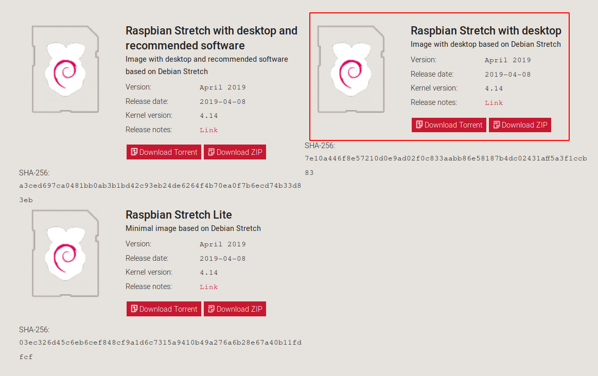
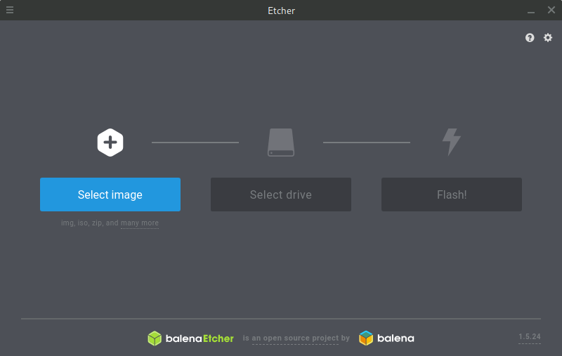
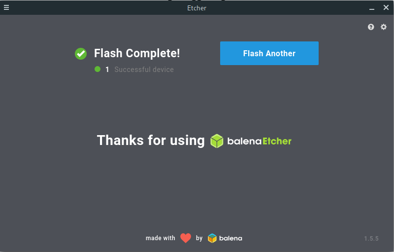
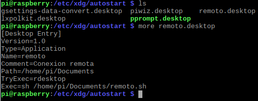
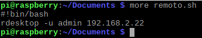

<h1 align="center" url="www.jmlion.com"> www.jmlion.com </h1>
<h1 align="center"> Automatizar conexión remota mediante Raspberry Pi </h1>

<p align="center">   </p>

## Índice:

- [Índice:](#%C3%ADndice)
- [Instalación del SO](#instalaci%C3%B3n-del-so)
- [Creación de script autostart](#creaci%C3%B3n-de-script-autostart)
- [Creación de script con inicio sesión](#creaci%C3%B3n-de-script-con-inicio-sesi%C3%B3n)
    - [Prueba del funcionamiento](#prueba-del-funcionamiento)
- [Creación de script con inicio automático](#creaci%C3%B3n-de-script-con-inicio-autom%C3%A1tico)
    - [Prueba del funcionamiento](#prueba-del-funcionamiento-1)
- [Otros parámetros](#otros-par%C3%A1metros)


## Instalación del SO

Empezamos accediendo a la página oficial de [Raspberry Pi](https://www.raspberrypi.org/downloads/raspbian/) y procedemos a la descarga de la imagen marcada ya que necesitamos interfaz gráfica y también que pese lo menos posible debido al uso que se le va a aplicar:



Mediante el Software [*Etcher*](https://www.balena.io/etcher/) que es una herramienta **Open Source** para grabar imágenes en *tarjetas y pendrive*.

Para ello lo descargamos de la página web (Compatible con Windows, Linux y MacOS) y lo ejecutamos:



Seleccionamos la imagen de *Raspbian* ya descargada anteriormente y la tarjeta la detecta automaticamente y le damos a **Flash!**


Una vez completado cerramos la ventana y procedemos a la instalación en la Raspberry Pi



## Creación de script autostart

Para que el script que vamos a crear a continuación se inicie según se encienda nuestra Raspberry Pi, tendremos que crear un fichero en el directorio */etc/xdg/autostart* y lo llamaremos [*remoto.desktop*](https://github.com/Wannaxry/script/blob/master/rdesktop%20autorun/Download/remoto.desktop).

Una vez lo creemos añadimos las siguientes líneas:

```[Desktop Entry]
Versión=1.0
Type=Application
Name=remoto
Comment=Conexion remota
Path=/home/pi/Documents
TryExec=rdesktop
Exec=sh /home/pi/Documents/remoto.sh
```



## Creación de script con inicio sesión

Una vez instalado el **Raspbian** en la Raspberry Pi procedemos a crear los dos ficheros necesarios o descargarlos directamente del directorio [Download](https://github.com/Wannaxry/script/tree/master/rdesktop%20autorun/Download).

Para empezar vamos al directorio en el cual pondremos el script principal [*remoto.sh*](https://github.com/Wannaxry/script/blob/master/rdesktop%20autorun/Download/remoto.sh).

En mi caso el script lo voy a crear en *Documentos* con un `nano remoto.sh` y dentro escribimos los siguiente:

```
#!/bin/bash
rdesktop -u (user) (IP)
```

Pondremos el usuario donde pone *user* (quitando los paréntesis) y la *IP* del servidor al que queramos establecer la conexión remota:



#### Prueba del funcionamiento


## Creación de script con inicio automático

Para el inico automatico lo unico que tendremos que haces es añadir -p y la contraseña al script

```
#!/bin/bash
rdesktop -u (user) -p (IP)
```

.png)

#### Prueba del funcionamiento


## Otros parámetros

Tambien tenemos otros parámetros que podemos añadir a la línea de comando como:

*   -**n**: Nombre Host del cliente
*   -**k**: Idioma del teclado
*   -**g**: Porcentaje que ocupará la ventana en nuestro escritorio
*   -**d**: Dominio
*   -**f**: Pantalla completa